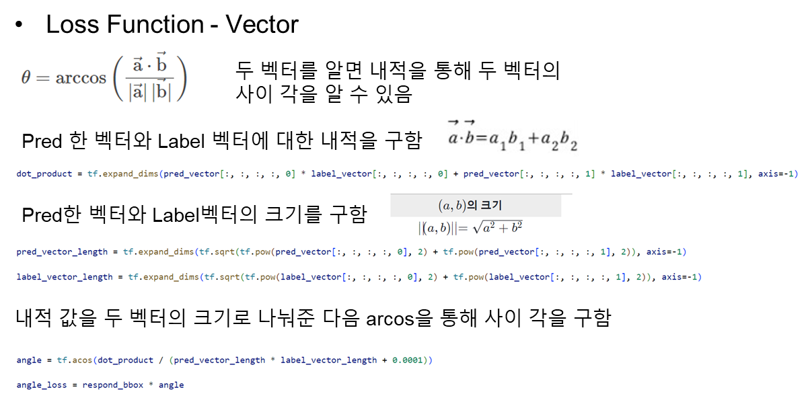

# Customizing YOLO v4 to Detect Parking Spaces

YOLOv3 and YOLOv4 implementation in TensorFlow 2.x, with support for training, transfer training, object tracking mAP and so on...
Code was tested with following specs:
- R5 5600X CPU and Nvidia RTX 3080 GPU
- OS Windows 11
- CUDA 11.7
- cuDNN v11.8
- Tensorflow-GPU 2.9.2
- Code was tested on only Windows 11
- You need custom_dataset to train the code (it's not an open source sorry T.T)

## Installation
First, clone or download this GitHub repository.
Install requirements:
```
pip install -r ./requirements.txt
```

## Looking into Custom Dataset
  
  
  
  

## Traing with Custom Dataset
  

## Decoding Code

  
  

## Loss Function
  

## Training
  

## Results
- Yellow : Slot is Occupied
- Red : Slot is Empty
  
  
  
  

